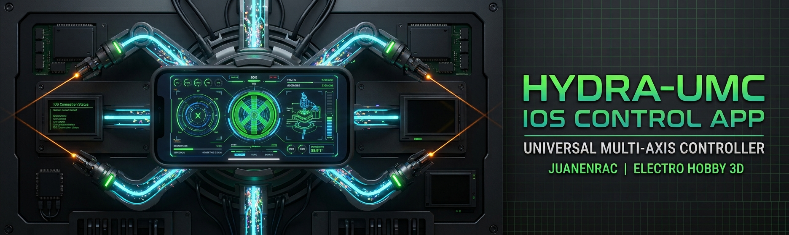

<p align="center">
  
</p>

# 📱 HYDRA-UMC CONTROL

A native Android app (Kotlin + Jetpack Compose) that controls a robot on the [HYDRA-UMC](https://github.com/JuanenRac/HYDRA-UMC) platform over Wi-Fi or Bluetooth, speaking the exact same [`REMOTE_API.md`](https://github.com/JuanenRac/HYDRA-UMC-SERVER/blob/main/docs/REMOTE_API.md) contract [HYDRA-UMC SUITE](https://github.com/JuanenRac/HYDRA-UMC-SUITE) uses - discovery, full-state read/write, and live WebSocket sync against a running [HYDRA-UMC-SERVER](https://github.com/JuanenRac/HYDRA-UMC-SERVER) backend (the same one [HYDRA-UMC STUDIO](https://github.com/JuanenRac/HYDRA-UMC-STUDIO)'s own web dashboard talks to). Direct Android counterpart to [HYDRA-UMC-IOS-CONTROL](https://github.com/JuanenRac/HYDRA-UMC-IOS-CONTROL). See [`docs/ARCHITECTURE.md`](docs/ARCHITECTURE.md) for the full design.

## 🏗️ What's implemented

- **Access Control & Biometrics** (`ui/LoginScreen.kt`, `util/BiometricHelper.kt`) - Professional login system with **Fingerprint and Face Unlock** support (`androidx.biometric`), plus IP/port fields right on the same screen so a server can be pointed at without a separate trip through Settings first. Includes "Remember me" functionality, a secure **Logout** mechanism, and fully localized in **5 languages**. The cached username/password/token (`network/AuthPrefs.kt`) live in Keystore-backed **EncryptedSharedPreferences** (AES256-GCM), not plaintext - every server in this ecosystem seeds a default `admin`/`admin` account on first start, with additional lower-privilege **operator** accounts creatable server-side from Config > Users.
- **Offline Mode & State Cache** (`network/StateCache.kt`) - Integrated persistence engine using **DataStore**. The app automatically caches the last known system state, allowing for instant dashboard viewing and configuration audits even without an active Wi-Fi connection.
- **Mission Notifications & Alerts** (`util/NotificationHelper.kt`) - Industrial-grade alerting system. Sends high-priority push notifications when a robot completes a job sequence or if critical hardware events occur, ensuring the operator is informed even when the app is in the background.
- **Industrial Telemetry Terminal** (`ui/TelemetryScreen.kt`) - A dedicated real-time log viewer with a terminal-style interface. Tracks system events, REST/WebSocket synchronization, and provides color-coded diagnostics (Matrix Green for success, Industrial Red for errors).
- **Advanced Dashboard** (`ui/DashboardScreen.kt`) - High-fidelity **3D Horizontal Carousel** with perspective swipe effects. Displays enriched robot metadata: **Manufacturer** (Source Robotics, Annin, Universal Robots, AgileX, etc.), **Robot Role** (CNC, Laser, PnP), and an **Industrial Module Matrix** with live status for CAM, XY, ATC, PNP, CNC, LSR, BED, VAC, and RCK modules.
- **System Health Monitor** (`ui/DashboardScreen.kt`) - Real-time metrics for the connected Compute Module 5, including **Hostname**, **Formatted Uptime** (e.g., "2d 4h 15m"), and active counts for controllers and robots.
- **Enhanced Manual Control** (`ui/ControlScreen.kt`) - Features a professional vertical layout with **50% larger Joystick buttons** for maximum precision. Includes a **Job/Trajectory Selector** to browse and execute files directly from the server.
- **Safety & Playback Panel** (`ui/ControlScreen.kt`) - Fixed bottom control bar housing the **E-STOP (Emergency Stop)**, **Start**, **Pause**, and **Stop** buttons. These controls are always visible and feature **Haptic Feedback** for physical sensory confirmation.
- **3D View** (`ui/ThreeDScreen.kt`) - Embeds HYDRA-UMC STUDIO's own real-time 3D viewport in a WebView (`?hideUI=true&robotId=&token=`), rather than a native renderer - `ui/NativeThreeDScreen.kt` is an unfinished Google Filament experiment (declared but not routed to from navigation, and has no `.glb` asset loading yet), kept in the tree for whoever picks that back up later but not the active code path. The WebView approach gets the real, currently-shipping STUDIO 3D scene (every real robot mesh/kinematics) for free instead of reimplementing it natively - the tradeoff is WebView rendering overhead, not battery-optimal, but functionally complete today.
- **Real-time Octal Vision** (`ui/CameraScreen.kt`, `ui/MjpegPlayer.kt`) - Industrial-grade **Native MJPEG Streamer**. Features an autonomous background parser and Canvas-based renderer for zero-latency video telemetry, a clear "Camera Disabled" state (instead of a silently blank feed) when a robot's vision system is off, and a switch to turn a robot's camera on/off directly from the server. Supports automatic **Picture-in-Picture (PIP)** overlays in the manual control screen, mapped to specific robots via the server's camera configuration.
- **Smart Discovery & Connectivity** (`network/Discovery.kt`, `network/HydraApiClient.kt`, `network/HydraWebSocket.kt`) - Concurrent subnet scan against every candidate host on the phone's own /24 (including the phone's own LAN IP and localhost, not just the other hosts), probing `GET /api/hydra-info` and identifying a real server purely by the presence of `remoteApiVersion` - the same check the manual-IP path uses, so a server whose owner renamed it away from the default product string is still found. An **NsdManager** (mDNS/Bonjour) listener runs alongside it - the server does announce itself as `_hydra._tcp` (`bonjour-service`), and `MainActivity` requests the runtime location/nearby-devices permission this needs up front (a manifest declaration alone never grants it on API 23+) - but the subnet scan stays the primary path since multicast reachability on Wi-Fi is inherently less reliable than a plain HTTP probe. The app automatically activates WiFi on startup, scans the local factory network, and performs a **Zero-Click Auto-connect** to the first available HYDRA-UMC server.
- **Secure Industrial Access** (`network/HydraApiClient.kt`, `ui/LoginScreen.kt`) - Professional security layer using **JWT (JSON Web Tokens)**. Every control command (Jog, Play, E-STOP) is validated by the server using signed tokens, sent over the atomic `POST /api/robot/:id/command` endpoint (see Atomic Command Sync below) - works for either the `admin` or `operator` role, unlike a full `POST /api/settings` write (admin-only server-side). Every request also carries an `X-Hydra-Client: android` header so the server's own Config > Remote Access tab can allow/block this app independently of SUITE/iOS. Seamlessly integrated with **Biometric Authentication** (Fingerprint/Face) for secure token renewal. A WebSocket closed with code `1008` (invalid/expired token) is treated as "sign in again," not retried in a reconnect loop (`network/HydraWebSocket.kt`).
- **Atomic Command Sync** (`viewmodel/RobotViewModel.kt`'s own `sendAtomicCommand()`) - Every write (enable/disable/play/pause/stop/jog/valve/pump/speed/vision) sends a small, single-robot atomic command instead of the entire settings tree - the server computes which combined robots are also affected, persists to disk, and broadcasts to every other connected client on its own. Enable/Disable propagates to a robot's own `combinedWith` siblings the same way Play/Pause/Stop does, since all of them share the same affected-robots computation.
- **Emergency Management Widget** (`widget/GlobalStopWidget.kt`) - Dedicated **Home Screen Widget** for critical safety. Provides a high-visibility, instant-access **Global E-STOP** button to freeze all robotic operations in the swarm without needing to open the app - reliably waits for the robot roster to actually load before acting, even from a fully cold start (process not already running).
- **Industrial Haptics & Safety** (`ui/ControlScreen.kt`) - Advanced sensory feedback system. Features real **Long-Press Protection** on the E-STOP and STOP buttons (a quick tap does nothing but a short buzz + hint; only a genuine hold sends the command) and differentiated haptic signatures (Success, Error, and Emergency pulses) to provide physical confirmation to the operator in noisy environments.
- **Toolchain & Project Quality** - AGP 9.3.1, Kotlin 2.2.10, Gradle 9.7.0, compileSdk 36, **JDK 21** (`compileOptions`, `gradle-daemon-jvm.properties`, and both `.idea/`/`.vscode/` project files all actually target it, not just this line of documentation). Clean build output with zero warnings, optimized R8 production variants, and advanced **Roborazzi** screenshot testing.

**Status: Wi-Fi, Bluetooth, Biometrics, and Notifications implemented.** The app is a high-grade industrial console ready for mission-critical robot operation.

## 🚀 Building

Requires **a JDK 21 specifically** and the Android SDK.

1. Install [Android Studio](https://developer.android.com/studio).
2. Open the project root and let the Gradle sync finish.
3. Connect a device and press ▶️ Run, or use the scripts below.

### 🛠️ Build + Install Scripts

The fastest path from a terminal at the repo root - builds the debug APK, lists connected devices via `adb`, and installs it in one go:

```bash
./build-android.sh     # Linux/macOS
build-android.bat      # Windows
```

If `adb` isn't on `PATH`, the script still finishes the build and prints where the APK landed so it can be installed by hand.

### ⚙️ Manual Build

Equivalent steps without the scripts, for CI or a plain terminal:

```bash
./gradlew assembleDebug        # Linux/macOS
gradlew.bat assembleDebug      # Windows
```

The APK lands at `app/build/outputs/apk/debug/app-debug.apk`. Install it with `adb install -r -d app/build/outputs/apk/debug/app-debug.apk`, or transfer it to the device manually. Swap `assembleDebug` for `assembleRelease` for a release build - it currently signs with the debug key (`app/build.gradle.kts`'s own `release` block, kept that way for easy testing), so it installs fine but isn't ready for distribution as-is.

## 🔢 Versioning

This repo follows an ecosystem-wide policy: the version bumps automatically on **every real build**, no manual editing of `app/build.gradle.kts`'s `versionName`/`versionCode`. `app/version.properties` holds the current `versionMajor`/`versionMinor`/`versionPatch`/`versionCode`; `app/build.gradle.kts` reads it, bumps it, and rewrites it at Gradle **configuration** time - which runs on every real build (`assembleDebug`, `compileDebugKotlin`, an IDE sync, ...) - so the produced APK always carries a number strictly newer than the last one:

- **Patch, odometer-style (base 10):** +1 on every build; once it would exceed 9 it resets to 0 and minor gets +1 instead - e.g. `1.0.9` -> `1.1.0`. Major is never touched automatically.
- **`versionCode`:** a plain monotonic counter, +1 on every build, no carry - Android requires it to strictly increase across every build that ever ships.

The running version is visible live in the **About** dialog (`BuildConfig.VERSION_NAME`, reading the same `versionName` Gradle just computed). See [CHANGELOG.md](CHANGELOG.md) for the version history.

## 📲 Testing against a live server

1. Run the backend: `cd HYDRA-UMC-SERVER && npm run dev` (Port 3000) - this is the actual REST/WS API this app talks to (see Related Projects below); `HYDRA-UMC-STUDIO`'s own `npm run dev` only starts its Vite frontend dev server (port 5173) against that same backend, it isn't the API server itself.
2. Connect your Android device to the same Wi-Fi.
3. Use the **Global Server Selector** or enter the IP manually in the header.
4. **Biometrics:** Enable "Biometric Login" in your User Profile to skip the password screen on the next launch.

## 🩺 Troubleshooting

| Symptom | Cause | Fix |
|---|---|---|
| No Notifications | Permission denied | Grant "Notifications" permission in Android settings for this app |
| No Biometrics | Hardware not set | Ensure you have a Fingerprint/Face registered in your Android System Security |
| Robot won't move | Browser cerebral link | Keep a HYDRA-UMC STUDIO browser tab open for IK processing |
| Bluetooth disabled | Physical chip off | Use the "ENABLE SYSTEM BT" 3D button in the app |

## 📂 Repository Structure

```text
HYDRA-UMC-ANDROID-CONTROL/
├── app/
│   ├── build.gradle.kts          # App module Gradle config - AGP/Kotlin/Compose versions, dependencies, debug-signed release build type
│   └── src/main/
│       ├── AndroidManifest.xml   # Permissions, activity/receiver declarations, usesCleartextTraffic (plain-HTTP LAN server, no TLS)
│       ├── java/com/hydraumc/control/
│       │   ├── MainActivity.kt          # Entry point - splash, login/main screen gating, cold-start-safe global E-STOP handling
│       │   ├── MainScreen.kt            # Bottom-nav scaffold, top bar (server selector, profile, telemetry, settings)
│       │   ├── model/
│       │   │   ├── BleDevice.kt          # Bluetooth LE scan result data class
│       │   │   └── HydraState.kt         # settings.json field-by-field mirror (RobotView/ControllerView/JobView) + ServerInfo discovery model
│       │   ├── network/
│       │   │   ├── AuthPrefs.kt           # Encrypted (AES256-GCM) credential/session storage
│       │   │   ├── ConnectionPrefs.kt     # Persisted server IP/port (DataStore Preferences)
│       │   │   ├── Discovery.kt           # Concurrent /24 subnet scan (primary) + NSD/mDNS listener (secondary) for finding a server on the LAN
│       │   │   ├── HydraApiClient.kt      # REST client - login, settings read/write, atomic robot commands, system metrics
│       │   │   ├── HydraBleClient.kt      # Bluetooth GATT client, alternative transport to Wi-Fi
│       │   │   ├── HydraWebSocket.kt      # Live state-delta push over WS, reconnect handling
│       │   │   └── StateCache.kt          # Last-known-state cache (DataStore) for offline dashboard viewing
│       │   ├── ui/
│       │   │   ├── AboutDialog.kt          # App/version info dialog
│       │   │   ├── CameraScreen.kt         # Per-robot MJPEG camera feed + vision on/off switch
│       │   │   ├── ControlScreen.kt        # Manual jog controls, E-STOP/play/pause/stop with long-press protection
│       │   │   ├── DashboardScreen.kt      # 3D carousel robot picker + system health + module matrix
│       │   │   ├── LoginScreen.kt          # Username/password + IP/port entry, biometric login
│       │   │   ├── MjpegPlayer.kt          # MJPEG stream parser + Canvas renderer
│       │   │   ├── NativeThreeDScreen.kt   # Google Filament native 3D visor - not wired into navigation yet, no .glb pipeline
│       │   │   ├── SettingsScreen.kt       # Wi-Fi/Bluetooth scan UI, connection settings
│       │   │   ├── SplashScreen.kt         # Custom Compose splash screen
│       │   │   ├── TelemetryScreen.kt      # Terminal-style event/sync log viewer
│       │   │   ├── ThreeDScreen.kt         # Real 3D viewport - WebView embedding STUDIO's own headless 3D scene
│       │   │   ├── UserProfileDialog.kt    # Profile edit + biometric toggle dialog
│       │   │   └── theme/
│       │   │       ├── Color.kt, Theme.kt, Typography.kt   # Material 3 color scheme, theme wrapper, type scale
│       │   │       └── HydraButton.kt, IndustrialComponents.kt, IndustrialStyle.kt   # Shared industrial-styled UI building blocks
│       │   ├── util/
│       │   │   ├── BiometricHelper.kt      # androidx.biometric prompt wrapper
│       │   │   └── NotificationHelper.kt   # Job-complete/safety push notifications
│       │   ├── viewmodel/
│       │   │   └── RobotViewModel.kt   # Shared ViewModel - networking, auth, discovery, atomic command dispatch, all UI state
│       │   └── widget/
│       │       └── GlobalStopWidget.kt # Home-screen widget for a global E-STOP without opening the app
│       └── res/
│           ├── drawable/, layout/, mipmap*/, xml/   # Icons, widget layout, launcher icons, backup/data-extraction rules
│           └── values/, values-es/, values-de/, values-fr/, values-it/   # Strings in 5 languages, colors, theme
├── docs/
│   └── ARCHITECTURE.md           # Design/architecture notes
├── images/                       # README banner + splash screen source assets
├── build-android.bat / .sh       # One-shot build + adb install convenience scripts
├── gradlew, gradlew.bat          # Gradle wrapper
├── build.gradle.kts, settings.gradle.kts, gradle.properties   # Root Gradle project config
├── local.properties              # Local Android SDK path (machine-specific, not committed)
├── .env.example                  # Example environment variables
├── README.md                     # This file
├── README_spa.md / README_ita.md / README_fra.md / README_deu.md   # Translations
└── LICENSE                       # GPL-3.0
```

## 🔗 Related Projects

This project is part of a larger robotics ecosystem by the same author (JuanenRac / Electro Hobby 3D). Worth knowing about, since a request might actually be about one of these rather than this repository:

**HYDRA-UMC platform** — the multi-robot micro-factory cell
- **[HYDRA-UMC](https://github.com/JuanenRac/HYDRA-UMC)** — the motherboard itself: Raspberry Pi CM5 host + dual-core STM32H745 real-time co-processor, orchestrating up to 8 distributed robot arms over CAN-OTA/SPI-OTA. Own hardware + firmware, GPL-3.0/CERN-OHL-S v2/CC BY-SA 4.0.
- **[HYDRA-UMC STUDIO](https://github.com/JuanenRac/HYDRA-UMC-STUDIO)** — web-based control dashboard for HYDRA-UMC: multi-robot 3D visualization, kinematics/trajectory recording, CAN-OTA flashing and testing for the whole platform. React + Vite + Three.js.
- **[HYDRA-UMC-SERVER](https://github.com/JuanenRac/HYDRA-UMC-SERVER)** — the headless backend (Node/Express/WebSocket) that used to be bundled inside HYDRA-UMC STUDIO's own process. Owns the robot-control REST/WS API, settings.json persistence, JWT auth, and mDNS discovery. HYDRA-UMC STUDIO is now a pure static frontend client that talks to it over the network.
- **HYDRA-UMC-ANDROID-CONTROL** *(this repository)* — Android control app for HYDRA-UMC over Wi-Fi/Bluetooth. Real, working app - full remote-control feature set, JWT auth, encrypted credential storage.
- **[HYDRA-UMC-IOS-CONTROL](https://github.com/JuanenRac/HYDRA-UMC-IOS-CONTROL)** — iOS/iPadOS control app for HYDRA-UMC over Wi-Fi, built in Flutter (cross-platform, verifiable on Windows without a Mac; final `.ipa` packaging still needs Xcode). Real, working app - same feature set as the Android app.
- **[HYDRA-UMC-SUITE](https://github.com/JuanenRac/HYDRA-UMC-SUITE)** — desktop (Python/PySide6) swarm command center: multi-controller network discovery, live bidirectional sync, real 3D robot viewport, Photoshop-style dockable workspace. Real and working, not a placeholder.
- **[HYDRA-UMC-EDITOR-URDF](https://github.com/JuanenRac/HYDRA-UMC-EDITOR-URDF)** — desktop (Python/PySide6) graphical URDF creator/editor for this project's own model catalog: pulls source files from GitHub or a local folder, validates DOF feasibility, edits color/scale/kinematics with a live 3D preview, and pushes the finished result to a running STUDIO server. Real and working, not a placeholder.
- **[HYDRA-UMC-DSI](https://github.com/JuanenRac/HYDRA-UMC-DSI)** — native Flutter touch UI for HYDRA-UMC's own 5"/7" DSI touchscreen (1280×720, same resolution at both sizes) on the Compute Module 5, controlling this same server directly from the board. Real, working scaffold with all 6 catalog screens (dashboard, manual control, camera, simplified 3D view, system metrics, login) connected to the live server; the real Linux build target has not yet been run on real hardware (Windows-only working environment so far - see that project's own README).

**URTC platform** — the tool head controller every HYDRA-UMC robot arm carries
- **[URTC](https://github.com/JuanenRac/URTC)** — Universal Robot Tool Controller: STM32F303-based CAN bus tool head controller, 25 fully-implemented tool profiles, CAN-OTA firmware update.
- **[URTC Flasher](https://github.com/JuanenRac/URTC-FLASHER)** — desktop CAN-OTA + full-chip SWD/JTAG flashing tool for URTC boards (Windows/Linux).
- **[URTC Tester](https://github.com/JuanenRac/URTC-TESTER)** — desktop live CAN-bus diagnostic tool for URTC boards, one panel per tool profile (Windows/Linux).
- **[URTC Web Studio](https://github.com/JuanenRac/URTC-WEB-STUDIO)** — browser-based alternative to the 2 desktop tools above (Web Serial API + SLCAN), no local install needed.

## 👤 Author

**JuanenRac** (Electro Hobby 3D)
📧 electrohobby3d@gmail.com
📺 youtube.com/@electrohobby3d

## 📜 License

**GNU General Public License v3.0 (GPL-3.0)** for the source code - see [`LICENSE`](LICENSE).

This documentation (this README and its own translations - `README_spa.md`, `README_ita.md`, `README_fra.md`, `README_deu.md`) is available under **Creative Commons Attribution-ShareAlike 4.0 International (CC BY-SA 4.0)**. Full text at https://creativecommons.org/licenses/by-sa/4.0/.
