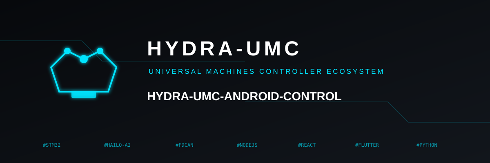

<p align="center">
  
</p>

# 📱 HYDRA-UMC CONTROL

<p align="center">
  <a href="README.md">🇺🇸 English</a> |
  <a href="README_spa.md">🇪🇸 Español</a> |
  🇫🇷 <b>Français</b> |
  <a href="README_ita.md">🇮🇹 Italiano</a> |
  <a href="README_deu.md">🇩🇪 Deutsch</a> |
  <a href="README_zho.md">🇨🇳 简体中文</a> |
  <a href="README_jpn.md">🇯🇵 日本語</a>
</p>


<p align="left">
  
  
  
  
</p>


Une application Android native (Kotlin + Jetpack Compose) qui contrôle un robot sur la plateforme [HYDRA-UMC](https://github.com/JuanenRac/HYDRA-UMC) via Wi-Fi ou Bluetooth, en parlant exactement le même contrat [`REMOTE_API.md`](https://github.com/JuanenRac/HYDRA-UMC-SERVER/blob/main/docs/REMOTE_API.md) que celui utilisé par [HYDRA-UMC SUITE](https://github.com/JuanenRac/HYDRA-UMC-SUITE) - découverte, lecture/écriture de l'état complet, et synchronisation live par WebSocket avec un backend [HYDRA-UMC-SERVER](https://github.com/JuanenRac/HYDRA-UMC-SERVER) en cours d'exécution (le même que celui utilisé par le tableau de bord web de [HYDRA-UMC STUDIO](https://github.com/JuanenRac/HYDRA-UMC-STUDIO)). Contrepartie Android directe de [HYDRA-UMC-IOS-CONTROL](https://github.com/JuanenRac/HYDRA-UMC-IOS-CONTROL). Voir [`docs/ARCHITECTURE.md`](docs/ARCHITECTURE.md) pour la conception complète.

## 🏗️ Ce qui est implémenté

- **Contrôle d'Accès et Biométrie** (`ui/LoginScreen.kt`, `util/BiometricHelper.kt`) - Système de connexion professionnel avec prise en charge de l'**empreinte digitale et du déverrouillage facial** (`androidx.biometric`), plus des champs IP/port directement sur le même écran pour pouvoir cibler un serveur sans passer d'abord par les Réglages. Comprend une fonction "Se souvenir de moi", un mécanisme de **déconnexion** sécurisé, et est entièrement localisé en **5 langues**. Le nom d'utilisateur/mot de passe/jeton mis en cache (`network/AuthPrefs.kt`) résident dans des **EncryptedSharedPreferences** adossées au Keystore (AES256-GCM), pas en texte clair - chaque serveur de cet écosystème initialise un compte `admin`/`admin` par défaut au premier démarrage, avec des comptes supplémentaires à privilège réduit de type **operator** pouvant être créés côté serveur depuis Config > Users.
- **Mode Hors Ligne et Cache d'État** (`network/StateCache.kt`) - Moteur de persistance intégré utilisant **DataStore**. L'application met automatiquement en cache le dernier état système connu, permettant un affichage instantané du tableau de bord et des audits de configuration même sans connexion Wi-Fi active.
- **Notifications et Alertes de Mission** (`util/NotificationHelper.kt`) - Système d'alerte de niveau industriel. Envoie des notifications push haute priorité lorsqu'un robot termine une séquence de travail ou en cas d'événements matériels critiques, garantissant que l'opérateur est informé même lorsque l'application est en arrière-plan.
- **Terminal de Télémétrie Industrielle** (`ui/TelemetryScreen.kt`) - Un visualiseur de journaux en temps réel dédié avec une interface de style terminal. Suit les événements système, la synchronisation REST/WebSocket, et fournit des diagnostics codés par couleur (Vert Matrix pour le succès, Rouge Industriel pour les erreurs).
- **Tableau de Bord Avancé** (`ui/DashboardScreen.kt`) - **Carrousel Horizontal 3D** haute fidélité avec effets de balayage en perspective. Affiche des métadonnées enrichies du robot : **Fabricant** (Source Robotics, Annin, Universal Robots, AgileX, etc.), **Rôle du Robot** (CNC, Laser, PnP), et une **Matrice de Modules Industrielle** avec état en direct pour les modules CAM, XY, ATC, PNP, CNC, LSR, BED, VAC et RCK.
- **Moniteur de Santé du Système** (`ui/DashboardScreen.kt`) - Métriques en temps réel pour la Compute Module 5 connectée, y compris le **nom d'hôte**, le **temps de disponibilité formaté** (par ex. « 2d 4h 15m »), et les décomptes actifs de contrôleurs et de robots.
- **Contrôle Manuel Amélioré** (`ui/ControlScreen.kt`) - Propose une disposition verticale professionnelle avec des **boutons de joystick 50 % plus grands** pour une précision maximale. Comprend un **sélecteur de tâche/trajectoire** pour parcourir et exécuter des fichiers directement depuis le serveur.
- **Panneau de Sécurité et de Lecture** (`ui/ControlScreen.kt`) - Barre de contrôle inférieure fixe abritant les boutons **E-STOP (arrêt d'urgence)**, **Start**, **Pause** et **Stop**. Ces contrôles sont toujours visibles et disposent d'un **retour haptique** pour une confirmation sensorielle physique.
- **Vue 3D** (`ui/ThreeDScreen.kt`) - Intègre le propre viewport 3D en temps réel de HYDRA-UMC STUDIO dans une WebView (`?hideUI=true&robotId=&token=`), plutôt qu'un moteur de rendu natif - `ui/NativeThreeDScreen.kt` est une expérience inachevée avec Google Filament (déclarée mais non reliée à la navigation, et sans chargement d'assets `.glb` pour l'instant), conservée dans l'arborescence pour quiconque la reprendra plus tard, mais ce n'est pas le chemin de code actif. L'approche WebView obtient gratuitement la véritable scène 3D de STUDIO actuellement en production (chaque maillage/cinématique réel de chaque robot) au lieu de la réimplémenter nativement - le compromis est la surcharge de rendu de la WebView, non optimale pour la batterie, mais fonctionnellement complète aujourd'hui.
- **Vision Octale en Temps Réel** (`ui/CameraScreen.kt`, `ui/MjpegPlayer.kt`) - **Streamer MJPEG natif** de niveau industriel. Dispose d'un analyseur autonome en arrière-plan et d'un moteur de rendu basé sur Canvas pour une télémétrie vidéo à latence nulle, un état clair « Caméra désactivée » (au lieu d'un flux vide silencieux) lorsque le système de vision d'un robot est éteint, et un interrupteur pour activer/désactiver la caméra d'un robot directement depuis le serveur. Prend en charge les incrustations automatiques **Picture-in-Picture (PIP)** dans l'écran de contrôle manuel, associées à des robots spécifiques via la configuration de caméra du serveur.
- **Découverte et Connectivité Intelligentes** (`network/Discovery.kt`, `network/HydraApiClient.kt`, `network/HydraWebSocket.kt`) - Analyse concurrente du sous-réseau sur chaque hôte candidat du propre /24 du téléphone (y compris l'IP LAN propre du téléphone et localhost, pas seulement les autres hôtes), sondant `GET /api/hydra-info` et identifiant un vrai serveur uniquement par la présence de `remoteApiVersion` - la même vérification que celle utilisée par le chemin IP manuel, de sorte qu'un serveur dont le propriétaire l'a renommé par rapport à la chaîne de produit par défaut est quand même trouvé. Un écouteur **NsdManager** (mDNS/Bonjour) tourne en parallèle - le serveur s'annonce bien comme `_hydra._tcp` (`bonjour-service`), et `MainActivity` demande à l'avance l'autorisation d'exécution de localisation/appareils à proximité nécessaire pour cela (une déclaration dans le manifeste seule ne l'accorde jamais sur API 23+) - mais l'analyse du sous-réseau reste le chemin principal car l'accessibilité multicast en Wi-Fi est intrinsèquement moins fiable qu'une simple sonde HTTP. L'application active automatiquement le WiFi au démarrage, scanne le réseau local de l'usine, et effectue une **connexion automatique sans clic** au premier serveur HYDRA-UMC disponible.
- **Accès Industriel Sécurisé** (`network/HydraApiClient.kt`, `ui/LoginScreen.kt`) - Couche de sécurité professionnelle utilisant **JWT (JSON Web Tokens)**. Chaque commande de contrôle (Jog, Play, E-STOP) est validée par le serveur à l'aide de jetons signés, envoyés via le point de terminaison atomique `POST /api/robot/:id/command` (voir Synchronisation des Commandes Atomiques ci-dessous) - fonctionne aussi bien avec le rôle `admin` qu'`operator`, contrairement à une écriture complète sur `POST /api/settings` (réservée à l'admin côté serveur). Chaque requête porte également un en-tête `X-Hydra-Client: android` afin que l'onglet Config > Remote Access du serveur puisse autoriser/bloquer cette application indépendamment de SUITE/iOS. Intégré sans accroc avec l'**authentification biométrique** (empreinte/visage) pour le renouvellement sécurisé des jetons. Un WebSocket fermé avec le code `1008` (jeton invalide/expiré) est traité comme « reconnectez-vous », sans être retenté dans une boucle de reconnexion (`network/HydraWebSocket.kt`).
- **Synchronisation des Commandes Atomiques** (le propre `sendAtomicCommand()` de `viewmodel/RobotViewModel.kt`) - Chaque écriture (enable/disable/play/pause/stop/jog/valve/pump/speed/vision) envoie une petite commande atomique concernant un seul robot au lieu de l'arbre de configuration entier - le serveur calcule quels robots combinés sont également affectés, persiste sur disque, et diffuse de lui-même à tous les autres clients connectés. Enable/Disable se propage aux propres frères `combinedWith` d'un robot de la même façon que le font Play/Pause/Stop, puisqu'ils partagent tous le même calcul de robots affectés.
- **Widget de Gestion des Urgences** (`widget/GlobalStopWidget.kt`) - **Widget d'écran d'accueil** dédié pour la sécurité critique. Fournit un bouton **E-STOP Global** à haute visibilité et accès instantané pour figer toutes les opérations robotiques de l'essaim sans avoir besoin d'ouvrir l'application - attend de manière fiable que la liste des robots soit réellement chargée avant d'agir, même après un démarrage à froid complet (processus pas encore en cours d'exécution).
- **Haptique et Sécurité Industrielle** (`ui/ControlScreen.kt`) - Système avancé de retour sensoriel. Dispose d'une véritable **protection par pression longue** sur les boutons E-STOP et STOP (un appui rapide ne fait rien à part un bref bourdonnement + une indication ; seul un maintien authentique envoie la commande) et de signatures haptiques différenciées (impulsions de succès, d'erreur et d'urgence) pour fournir une confirmation physique à l'opérateur dans des environnements bruyants.
- **Chaîne d'Outils et Qualité du Projet** - AGP 9.3.1, Kotlin 2.2.10, Gradle 9.7.0, compileSdk 36, **JDK 21** (`compileOptions`, `gradle-daemon-jvm.properties`, et les fichiers de projet `.idea/` comme `.vscode/` le ciblent réellement, pas seulement cette ligne de documentation). Sortie de build propre sans avertissement, variantes de production R8 optimisées, et tests de captures d'écran avancés avec **Roborazzi**.

**État : Wi-Fi, Bluetooth, biométrie et notifications implémentés.** L'application est une console industrielle haut de gamme prête pour des opérations robotiques à mission critique.

## 🚀 Compilation

Nécessite **spécifiquement un JDK 21** et le Android SDK.

1. Installez [Android Studio](https://developer.android.com/studio).
2. Ouvrez la racine du projet et laissez la synchronisation Gradle se terminer.
3. Connectez un appareil et appuyez sur ▶️ Run, ou utilisez les scripts ci-dessous.

### 🛠️ Scripts de compilation + installation

Le chemin le plus rapide depuis un terminal à la racine du dépôt - compile l'APK de débogage, liste les appareils connectés via `adb`, et l'installe en une seule fois :

```bash
./build-android.sh     # Linux/macOS
build-android.bat      # Windows
```

Si `adb` n'est pas dans le `PATH`, le script termine quand même la compilation et affiche où l'APK a atterri afin qu'il puisse être installé manuellement.

### ⚙️ Compilation manuelle

Étapes équivalentes sans les scripts, pour l'intégration continue ou un simple terminal :

```bash
./gradlew assembleDebug        # Linux/macOS
gradlew.bat assembleDebug      # Windows
```

L'APK atterrit dans `app/build/outputs/apk/debug/app-debug.apk`. Installez-le avec `adb install -r -d app/build/outputs/apk/debug/app-debug.apk`, ou transférez-le manuellement sur l'appareil. Remplacez `assembleDebug` par `assembleRelease` pour une compilation de release - elle signe actuellement avec la clé de débogage (le propre bloc `release` de `app/build.gradle.kts`, conservé ainsi pour faciliter les tests), donc elle s'installe correctement mais n'est pas prête pour la distribution telle quelle.

## 🔢 Gestion des versions

Ce dépôt suit une politique à l'échelle de l'écosystème : le numéro de version augmente automatiquement à **chaque build réel**, sans modification manuelle de `versionName`/`versionCode` dans `app/build.gradle.kts`. `app/version.properties` conserve les valeurs actuelles de `versionMajor`/`versionMinor`/`versionPatch`/`versionCode` ; `app/build.gradle.kts` les lit, les incrémente et réécrit le fichier au moment de la **configuration** de Gradle - ce qui se produit à chaque build réel (`assembleDebug`, `compileDebugKotlin`, une synchronisation de l'IDE, ...) - de sorte que l'APK produit porte toujours un numéro strictement supérieur au précédent :

- **Patch, façon compteur kilométrique (base 10) :** +1 à chaque build ; s'il dépasserait 9, il revient à 0 et le minor augmente de +1 - exemple : `0.0.9` -> `0.1.0`. Le major n'est jamais modifié automatiquement.
- **`versionCode` :** un simple compteur monotone, +1 à chaque build, sans report - Android exige qu'il augmente strictement à chaque build réellement diffusée.

La version en cours d'exécution est visible en direct dans la boîte de dialogue **À propos** (`BuildConfig.VERSION_NAME`, qui lit le même `versionName` que Gradle vient de calculer). Voir [CHANGELOG.md](CHANGELOG.md) pour l'historique des versions.

## 📲 Tests contre un serveur réel

1. Lancez le backend : `cd HYDRA-UMC-SERVER && npm run dev` (Port 3000) - c'est la véritable API REST/WS à laquelle parle l'application (voir Projets connexes plus bas) ; le `npm run dev` de `HYDRA-UMC-STUDIO` ne fait que démarrer son propre serveur de développement Vite du frontend (port 5173) contre ce même backend, ce n'est pas le serveur de l'API en tant que tel.
2. Connectez votre appareil Android au même Wi-Fi.
3. Utilisez le **sélecteur de serveur global** ou saisissez l'IP manuellement dans l'en-tête.
4. **Biométrie :** activez « Biometric Login » dans votre profil utilisateur pour sauter l'écran de mot de passe au prochain lancement.

## 🩺 Dépannage

| Symptôme | Cause | Solution |
|---|---|---|
| Aucune notification | Autorisation refusée | Accordez l'autorisation « Notifications » dans les réglages Android pour cette application |
| Aucune biométrie | Matériel non configuré | Assurez-vous d'avoir une empreinte/un visage enregistré dans la sécurité système Android |
| Le robot ne bouge pas | Lien cérébral du navigateur | Gardez un onglet de navigateur HYDRA-UMC STUDIO ouvert pour le traitement de la cinématique inverse (IK) |
| Bluetooth désactivé | Puce physique éteinte | Utilisez le bouton 3D « ENABLE SYSTEM BT » dans l'application |

## 📂 Structure du dépôt

```text
HYDRA-UMC-ANDROID-CONTROL/
├── app/
│   ├── build.gradle.kts          # Configuration Gradle du module app - versions AGP/Kotlin/Compose, dépendances, type de build release signé avec la clé de débogage
│   ├── version.properties        # Version de l'app type compteur kilométrique + versionCode Android, synchronisés par bump_manifest_version.py/bump_version_code.py
│   ├── proguard-rules.pro        # Règles de réduction/obfuscation du code pour le build release
│   └── src/main/
│       ├── AndroidManifest.xml   # Permissions, déclarations d'activity/receiver, usesCleartextTraffic (serveur LAN HTTP simple, sans TLS)
│       ├── java/com/hydraumc/control/
│       │   ├── MainActivity.kt          # Point d'entrée - écran de démarrage, contrôle d'accès login/écran principal, gestion sûre de l'E-STOP global au démarrage à froid
│       │   ├── MainScreen.kt            # Structure de navigation inférieure, barre supérieure (sélecteur de serveur, profil, télémétrie, réglages)
│       │   ├── kinematics/
│       │   │   └── Parol6Kinematics.kt   # Cinématique directe/inverse spécifique au Parol6
│       │   ├── model/
│       │   │   ├── BleDevice.kt          # Data class pour le résultat de scan Bluetooth LE
│       │   │   └── HydraState.kt         # Miroir champ par champ de settings.json (RobotView/ControllerView/JobView) + modèle de découverte ServerInfo
│       │   ├── network/
│       │   │   ├── AuthPrefs.kt           # Stockage chiffré (AES256-GCM) des identifiants/session
│       │   │   ├── ConnectionPrefs.kt     # IP/port du serveur persistés (DataStore Preferences)
│       │   │   ├── Discovery.kt           # Analyse concurrente du sous-réseau /24 (principale) + écouteur NSD/mDNS (secondaire) pour trouver un serveur sur le LAN
│       │   │   ├── HydraApiClient.kt      # Client REST - connexion, lecture/écriture des réglages, commandes atomiques de robot, métriques système
│       │   │   ├── HydraBleClient.kt      # Client GATT Bluetooth, transport alternatif au Wi-Fi
│       │   │   ├── HydraWebSocket.kt      # Envoi live des deltas d'état via WS, gestion de la reconnexion
│       │   │   └── StateCache.kt          # Cache du dernier état connu (DataStore) pour l'affichage du tableau de bord hors ligne
│       │   ├── ui/
│       │   │   ├── AboutDialog.kt          # Boîte de dialogue d'informations app/version
│       │   │   ├── CameraScreen.kt         # Flux caméra MJPEG par robot + interrupteur vision on/off
│       │   │   ├── ControlScreen.kt        # Contrôles de jog manuels, E-STOP/play/pause/stop avec protection par pression longue
│       │   │   ├── DashboardScreen.kt      # Sélecteur de robot à carrousel 3D + santé du système + matrice de modules
│       │   │   ├── Joystick3D.kt           # Composant joystick réutilisable à 2 axes
│       │   │   ├── LoginScreen.kt          # Saisie nom d'utilisateur/mot de passe + IP/port, connexion biométrique
│       │   │   ├── MjpegPlayer.kt          # Analyseur de flux MJPEG + moteur de rendu Canvas
│       │   │   ├── NativeThreeDScreen.kt   # Visualiseur 3D natif Google Filament - pas encore relié à la navigation, aucun pipeline .glb
│       │   │   ├── PlaybackConsole.kt      # Console flottante partagée E-STOP/play/pause/stop
│       │   │   ├── SettingsScreen.kt       # Interface de scan Wi-Fi/Bluetooth, réglages de connexion
│       │   │   ├── SplashScreen.kt         # Écran de démarrage Compose personnalisé
│       │   │   ├── TelemetryScreen.kt      # Visualiseur de journal d'événements/synchronisation en style terminal
│       │   │   ├── ThreeDScreen.kt         # Viewport 3D réel - WebView intégrant la propre scène 3D headless de STUDIO
│       │   │   ├── UserProfileDialog.kt    # Boîte de dialogue d'édition de profil + interrupteur biométrique
│       │   │   └── theme/
│       │   │       ├── Color.kt, Theme.kt, Typography.kt   # Schéma de couleurs Material 3, enrobage de thème, échelle typographique
│       │   │       └── HydraButton.kt, IndustrialComponents.kt, IndustrialStyle.kt   # Blocs d'interface partagés au style industriel
│       │   ├── update/
│       │   │   ├── GitHubReleaseUpdater.kt   # Client de mise à jour sécurisé via GitHub Release
│       │   │   ├── ReleaseMetadataParser.kt  # Analyseur sécurisé des métadonnées de GitHub Release
│       │   │   └── SemanticVersion.kt        # Analyseur strict de version sémantique pour les mises à jour
│       │   ├── util/
│       │   │   ├── BiometricHelper.kt      # Enrobage de l'invite androidx.biometric
│       │   │   ├── NotificationHelper.kt   # Notifications push de travail terminé/sécurité
│       │   │   └── NotificationPrefs.kt    # Stockage persistant du commutateur de notifications in-app
│       │   ├── viewmodel/
│       │   │   ├── AppUpdateViewModel.kt   # État de mise à jour de l'app conscient du cycle de vie
│       │   │   └── RobotViewModel.kt   # ViewModel partagé - réseau, authentification, découverte, envoi des commandes atomiques, tout l'état de l'interface
│       │   ├── wear/
│       │   │   ├── WatchCompanionProtocol.kt    # Contrat filaire de statut de version du companion Watch
│       │   │   ├── WatchVoiceRelayContract.kt   # Contrat filaire authentifié du relais vocal Watch
│       │   │   └── WatchVoiceRelayService.kt    # Service de relais vocal Wear OS
│       │   └── widget/
│       │       └── GlobalStopWidget.kt # Widget d'écran d'accueil pour un E-STOP global sans ouvrir l'application
│       └── res/
│           ├── drawable/, layout/, mipmap*/, xml/   # Icônes, disposition du widget, icônes de lanceur, règles de sauvegarde/extraction de données
│           └── values/, values-es/, values-de/, values-fr/, values-it/, values-ja/, values-zh/   # Chaînes en 7 langues, couleurs, thème
├── docs/
│   ├── ARCHITECTURE.md              # Notes de conception/architecture
│   ├── GITHUB_RELEASE_UPDATES.md    # Flux in-app de vérification/téléchargement/installation des mises à jour
│   └── WATCH_VOICE_RELAY.md         # Contrat du relais vocal montre-téléphone-serveur
├── images/                       # Ressources sources de la bannière README + écran de démarrage
├── tools/
│   ├── build_test.py             # Contrôle build/compilation sans gestion de version
│   └── ci_validate.py            # Validation manifest/CHANGELOG/docs utilisée par la CI
├── dist/                         # Sortie de l'APK de release signé (ignoré par git)
├── build-android.bat / .sh       # Scripts de commodité pour compiler + installer via adb en une seule fois
├── build-test.bat / .sh          # Contrôle build/compilation sans gestion de version
├── prepare-github-release.bat / .sh  # Compile un APK de release signé en privé et stable, sans incrémenter la version
├── publish-github-release.ps1 / .sh  # Local uniquement : publie l'APK de dist/ en tant que GitHub Release
├── bump_manifest_version.py      # Synchronise la version de hydra-umc.project.json avec la version native (--sync)
├── bump_version_code.py          # Incrémente le compteur versionCode propre à Android dans app/version.properties
├── gradlew, gradlew.bat          # Wrapper Gradle
├── build.gradle.kts, settings.gradle.kts, gradle.properties   # Configuration racine du projet Gradle
├── local.properties              # Chemin local du SDK Android (spécifique à la machine, non commité)
├── keystore.properties.example   # Modèle de configuration privée de signature de release
├── .env.example                  # Exemple de variables d'environnement
├── metadata.json                 # Métadonnées de fiche App Store (nom/description)
├── README.md                     # Ce fichier
├── README_spa.md / README_ita.md / README_fra.md / README_deu.md / README_zho.md / README_jpn.md   # Traductions
└── LICENSE                       # GPL-3.0
```

## 🔗 Projets connexes

Ce projet fait partie de l'écosystème robotique HYDRA-UMC du même auteur (JuanenRac / Electro Hobby 3D). Bon à savoir, car une demande pourrait en réalité concerner l'un de ceux-ci plutôt que ce dépôt.

**Projet Parent**
- **[HYDRA-UMC-SERVER](https://github.com/JuanenRac/HYDRA-UMC-SERVER)** — le vrai backend headless (REST/WebSocket) auquel parle réellement chaque client de contrôle ; le backend contre lequel s'exécutent la découverte, l'authentification et la synchronisation WebSocket propres à cette application.

**Projets Frères** — parlent également à la propre API de HYDRA-UMC-SERVER, chacun en tant que son propre client
- **[HYDRA-UMC-STUDIO](https://github.com/JuanenRac/HYDRA-UMC-STUDIO)** — tableau de bord de contrôle web avec visualisation 3D multi-robot en temps réel ; son propre visualiseur 3D est intégré directement dans l'écran Vue 3D de cette application via WebView.
- **[HYDRA-UMC-SUITE](https://github.com/JuanenRac/HYDRA-UMC-SUITE)** — centre de commande d'essaim de bureau (PySide6) pour plusieurs serveurs à la fois, empaqueté en exécutable autonome ; parle exactement le même contrat `REMOTE_API.md` que cette application.
- **[HYDRA-UMC-IOS-CONTROL](https://github.com/JuanenRac/HYDRA-UMC-IOS-CONTROL)** — application de contrôle iOS/iPadOS (Flutter) avec synchronisation WebSocket en temps réel ; l'équivalent direct iOS/iPadOS de cette application, avec le même ensemble de fonctionnalités.
- **[HYDRA-UMC-DSI](https://github.com/JuanenRac/HYDRA-UMC-DSI)** — interface tactile native pour l'écran tactile DSI 7" embarqué, intégrée directement sur le CM5.
- **[HYDRA-UMC-BRIDGE-AMR](https://github.com/JuanenRac/HYDRA-UMC-BRIDGE-AMR)** — frontière de coordination pour les flottes AGV/AMR via un éditeur MQTT VDA 5050 réel.
- **[HYDRA-UMC-BRIDGE-CNC](https://github.com/JuanenRac/HYDRA-UMC-BRIDGE-CNC)** — coordinateur haut niveau pour cellules CNC avec accès réel au statut/octets de contrôle GRBL.
- **[HYDRA-UMC-BRIDGE-DROIDS](https://github.com/JuanenRac/HYDRA-UMC-BRIDGE-DROIDS)** — frontière de coordination pour droïdes à pattes/humanoïdes, avec un véritable émetteur de commandes Boston Dynamics Spot.
- **[HYDRA-UMC-BRIDGE-LASER](https://github.com/JuanenRac/HYDRA-UMC-BRIDGE-LASER)** — coordinateur de sécurité pour cellules laser lisant 3 vraies sécurités GPIO de clé/enceinte/verrouillage.
- **[HYDRA-UMC-BRIDGE-OPENPNP](https://github.com/JuanenRac/HYDRA-UMC-BRIDGE-OPENPNP)** — coordinateur haut niveau sûr pour le flux de cartes du pick-and-place OpenPnP.
- **[HYDRA-UMC-BRIDGE-PRINTER3D](https://github.com/JuanenRac/HYDRA-UMC-BRIDGE-PRINTER3D)** — frontière de coordination sûre pour imprimantes 3D Moonraker/Klipper, avec de vraies commandes de tâche contrôlées.
- **[HYDRA-UMC-BRIDGE-ROS2](https://github.com/JuanenRac/HYDRA-UMC-BRIDGE-ROS2)** — coordinateur de sécurité avec un vrai transport ROS 2 rclpy à importation paresseuse.
- **[HYDRA-UMC-BRIDGE-UAV](https://github.com/JuanenRac/HYDRA-UMC-BRIDGE-UAV)** — frontière de coordination pour UAV équipés de caméra, avec un véritable émetteur de commandes MAVLink.

**Directement Liés**
- **[HYDRA-UMC-WATCH](https://github.com/JuanenRac/HYDRA-UMC-WATCH)** — application compagnon WearOS avec de vraies alertes haptiques et un relais vocal vers le téléphone jumelé ; la compagne WearOS de cette application, pour le statut et le contrôle du robot en un coup d'œil depuis le poignet.
- **[HYDRA-UMC-HIL-BRIDGE](https://github.com/JuanenRac/HYDRA-UMC-HIL-BRIDGE)** — vrai verrouillage de sécurité hardware-in-the-loop routant les commandes entre simulation et matériel réel ; permet le contrôle à distance du jumeau numérique directement depuis cette application.

**Fait Également Partie de l'Écosystème**

*Matériel & Plateforme de Base*
- **[HYDRA-UMC](https://github.com/JuanenRac/HYDRA-UMC)** — la carte mère physique du bras robotique : hôte CM5 + coprocesseur STM32H745 double cœur, coordonnant jusqu'à 8 bras-outils via CAN-OTA/SPI-OTA.
- **[HYDRA-UMC-OS](https://github.com/JuanenRac/HYDRA-UMC-OS)** — couche produit reproductible sur Raspberry Pi OS pour le CM5 : agent en lecture seule, config/profils validés, provisionnement WiFi de premier contact.
- **[HYDRA-UMC-SDK](https://github.com/JuanenRac/HYDRA-UMC-SDK)** — le contrat JSON-Schema partagé et la barrière de sécurité contre laquelle chaque bridge valide ses commandes.

*Backend Central & Clients*
- **[HYDRA-UMC-EDITOR-URDF](https://github.com/JuanenRac/HYDRA-UMC-EDITOR-URDF)** — créateur/éditeur graphique de bureau pour URDF qui envoie les modèles terminés vers le propre catalogue de STUDIO.

*Plateforme d'Outils URTC*
- **[URTC](https://github.com/JuanenRac/URTC)** — firmware pour la carte physique Universal Robot Tool Controller, plus de 25 profils d'outil sur bus CAN.
- **[URTC-FLASHER](https://github.com/JuanenRac/URTC-FLASHER)** — outil de bureau à interface graphique pour flasher les cartes URTC, CAN-OTA plus SWD/JTAG puce complète.
- **[URTC-TESTER](https://github.com/JuanenRac/URTC-TESTER)** — outil de bureau de diagnostic CAN-bus en direct pour cartes URTC, un panneau par profil d'outil.
- **[URTC-WEB-STUDIO](https://github.com/JuanenRac/URTC-WEB-STUDIO)** — alternative basée navigateur à URTC-TESTER via la Web Serial API, sans installation locale.

*Nœud IA de Vision (Hailo-8)*
- **[HYDRA-UMC-VISION-NODE](https://github.com/JuanenRac/HYDRA-UMC-VISION-NODE)** — hub d'intégration pour le pipeline de vision Hailo-8, avec une vraie vérification de disponibilité matérielle par étape.
- **[HYDRA-UMC-DETECTION-HEF](https://github.com/JuanenRac/HYDRA-UMC-DETECTION-HEF)** — registre réel de modèles compilés avec vérification de chargement sécurisé par architecture Hailo/checksum.
- **[HYDRA-UMC-VISION-STREAMER](https://github.com/JuanenRac/HYDRA-UMC-VISION-STREAMER)** — générateur réel de pipeline GStreamer + config MediaMTX, avec une vraie frontière d'intégration HailoRT.
- **[HYDRA-UMC-VISUAL-SERVOING-API](https://github.com/JuanenRac/HYDRA-UMC-VISUAL-SERVOING-API)** — vraie loi de correction Position-Based Visual Servoing, verrouillée sur l'état de zone en amont.
- **[HYDRA-UMC-SAFETY-ZONES](https://github.com/JuanenRac/HYDRA-UMC-SAFETY-ZONES)** — vraie vérification de violation de zone et demande d'E-STOP, avec application de la fraîcheur de calibration.

*Nœud IA Cognitif (Hailo-10)*
- **[HYDRA-UMC-COGNITIVE-NODE](https://github.com/JuanenRac/HYDRA-UMC-COGNITIVE-NODE)** — hub d'intégration pour le pipeline cognitif Hailo-10 (orchestration LLM/VLA/voix).
- **[HYDRA-UMC-VLA-ENGINE](https://github.com/JuanenRac/HYDRA-UMC-VLA-ENGINE)** — vrai encodage/décodage de jetons d'action et génération de trajectoire pour un modèle Vision-Language-Action.
- **[HYDRA-UMC-VOICE-UI](https://github.com/JuanenRac/HYDRA-UMC-VOICE-UI)** — vrai front-end vocal (VAD + analyseur d'intention) avec un relais Watch borné et soumis à confirmation.
- **[HYDRA-UMC-SEMANTIC-PLANNER](https://github.com/JuanenRac/HYDRA-UMC-SEMANTIC-PLANNER)** — vraie décomposition de tâches basée sur des règles et récupération sémantique d'erreurs sur les codes d'erreur MCU.
- **[HYDRA-UMC-DOCS-QA](https://github.com/JuanenRac/HYDRA-UMC-DOCS-QA)** — vraie recherche documentaire TF-IDF (bibliothèque standard uniquement) sur les propres documents Markdown de cet écosystème.

*Orchestration & Essaim*
- **[HYDRA-UMC-ORCHESTRATOR](https://github.com/JuanenRac/HYDRA-UMC-ORCHESTRATOR)** — hub d'intégration avec un vrai contrat de rapport de santé gRPC/Protobuf et une machine à états de mission.
- **[HYDRA-UMC-JOB-DISPATCHER](https://github.com/JuanenRac/HYDRA-UMC-JOB-DISPATCHER)** — vraie file de tâches basée sur la priorité avec déduplication, via une vraie API HTTP.
- **[HYDRA-UMC-NODE-HEALING](https://github.com/JuanenRac/HYDRA-UMC-NODE-HEALING)** — vrai chien de garde de santé de flotte basé sur gRPC, avec retry/backoff et détection d'incohérence d'identité.
- **[HYDRA-UMC-PATH-PLANNER-3D](https://github.com/JuanenRac/HYDRA-UMC-PATH-PLANNER-3D)** — vrai planificateur de trajectoire 3D basé sur RRT, avec vraie validation des collisions obstacle/espace de travail.
- **[HYDRA-UMC-SWARM-SYNC](https://github.com/JuanenRac/HYDRA-UMC-SWARM-SYNC)** — vraie synchronisation d'état CRDT LWW-Element-Map, testée par propriétés pour la convergence multi-cellule.

*Jumeau Numérique & Simulation*
- **[HYDRA-UMC-TWIN](https://github.com/JuanenRac/HYDRA-UMC-TWIN)** — hub d'intégration pour le moteur de jumeau numérique, avec un vrai contrat de synchronisation par compatibilité de version.
- **[HYDRA-UMC-PHYSICS-REPLICA](https://github.com/JuanenRac/HYDRA-UMC-PHYSICS-REPLICA)** — vraie cinématique directe et validation des limites articulaires sur un vrai sous-ensemble URDF.
- **[HYDRA-UMC-SYNTHETIC-DATA-GEN](https://github.com/JuanenRac/HYDRA-UMC-SYNTHETIC-DATA-GEN)** — vrai générateur procédural de scènes 2D avec export d'annotations YOLO/COCO.

*Données & Analytique*
- **[HYDRA-UMC-DATALAKE](https://github.com/JuanenRac/HYDRA-UMC-DATALAKE)** — vrai magasin de séries temporelles basé sur sqlite3, avec une vraie API HTTP d'ingestion/requête.
- **[HYDRA-UMC-ANOMALY-DETECTOR](https://github.com/JuanenRac/HYDRA-UMC-ANOMALY-DETECTOR)** — vrai détecteur d'anomalies FFT + ligne de base statistique, avec surveillance de dérive.
- **[HYDRA-UMC-PRODUCTION-REPORTS](https://github.com/JuanenRac/HYDRA-UMC-PRODUCTION-REPORTS)** — vrai calcul OEE/disponibilité sur l'historique de DATALAKE, avec export CSV reproductible.
- **[HYDRA-UMC-TELEMETRY-COLLECTOR](https://github.com/JuanenRac/HYDRA-UMC-TELEMETRY-COLLECTOR)** — vrai pipeline d'ingestion CAN/WebSocket vers DATALAKE, avec déduplication par séquence.

*Passerelle Industrielle*
- **[HYDRA-UMC-GATEWAY-INDUSTRIAL](https://github.com/JuanenRac/HYDRA-UMC-GATEWAY-INDUSTRIAL)** — hub d'intégration relayant vers les protocoles industriels, avec une vraie couche de liste blanche de commandes/contre-pression.
- **[HYDRA-UMC-OPCUA-SERVER](https://github.com/JuanenRac/HYDRA-UMC-OPCUA-SERVER)** — vrai espace d'adressage OPC-UA, vérifié avec une vraie session client du protocole binaire.
- **[HYDRA-UMC-MQTT-BROKER](https://github.com/JuanenRac/HYDRA-UMC-MQTT-BROKER)** — vrai broker MQTT avec authentification par client optionnelle et ACL de sujets.
- **[HYDRA-UMC-MTCONNECT-ADAPTER](https://github.com/JuanenRac/HYDRA-UMC-MTCONNECT-ADAPTER)** — vrais points de terminaison XML MTConnect `/probe` et `/current`, avec sortie en mode dégradé.

*Outils Complémentaires & Opérations de l'Écosystème*
- **[HYDRA-UMC-DASHBOARD-AI](https://github.com/JuanenRac/HYDRA-UMC-DASHBOARD-AI)** — panneaux Smart Summaries et Anomaly Highlighting sur DATALAKE/ANOMALY-DETECTOR, avec un repli statistique honnête.
- **[HYDRA-UMC-TOOL-CLI](https://github.com/JuanenRac/HYDRA-UMC-TOOL-CLI)** — CLI de flotte avec un vrai contrat de codes de sortie stable, un vrai client en direct de la propre API de HYDRA-UMC-SERVER.
- **[URTC-SMART-RACK](https://github.com/JuanenRac/URTC-SMART-RACK)** — firmware pour un rack de montage de cartes avec décodage réel d'ID d'outil et logique de préchauffage Smart Idle.
- **[URTC-VISION-TOOL](https://github.com/JuanenRac/URTC-VISION-TOOL)** — firmware plus un vrai compagnon de vision Python pour une tête d'outil d'inspection thermique/RGB.
- **[HYDRA-UMC-UPDATER](https://github.com/JuanenRac/HYDRA-UMC-UPDATER)** — outil administratif de bureau qui découvre, clone et met à jour chaque dépôt de cet écosystème.

## 👤 AUTEUR
**JuanenRac** (Electro Hobby 3D)
📧 electrohobby3d@gmail.com
📺 [youtube.com/@electrohobby3d](https://youtube.com/@electrohobby3d)

## 📜 LICENCE

**GNU General Public License v3.0 (GPL-3.0)** pour le code source - voir [`LICENSE`](LICENSE).

Cette documentation (ce README et ses propres traductions - `README_spa.md`, `README_ita.md`, `README_fra.md`, `README_deu.md`, `README_zho.md`, `README_jpn.md`) est disponible sous **Creative Commons Attribution-ShareAlike 4.0 International (CC BY-SA 4.0)**. Texte complet sur https://creativecommons.org/licenses/by-sa/4.0/.
